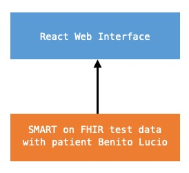

# Project Documentation

## Technical and/or User Manual
The application is built with React and can be run without any additional configuration. 

Start by installing any needed dependencies with 
`npm install`

Then simply run the application with the command 
`npm start`

The app is running on port 3000 and can be accessed on: 
[localhost:3000/](localhost:3000/)

When the app is first started, log in with the following credentials: 

Username: patient
Password: patient 

The application is configured to use the SMART on FHIR patient Benito Lucio. 

Here is a breif overview of each page view: 

- Dashboard [/portal](localhost:3000/portal): Display an aggregate of all medical events with links to more detailed information 
- Vaccination [/portal/vaccination](localhost:3000/portal/vaccination): Displays the patients vaccinations, grouped by the vaccine type 
- Medication [/portal/medication](localhost:3000/portal/medication): Displays the patients medications and associates the medication with the conditions they were prescribed to treat
- Conditions [/portal/conditions](localhost:3000/portal/conditions): Displays all conditions, both active and resolved ones. Also associates active medications with the conditions. 
- Lab Results [/portal/labresults](localhost:3000/portal/labresults): Displays lab results, either grouped by the lab type or by the lab encounter. Pressing a specific lab test in either view displays the historic progression of that measurement over time. Note that this page omits displaying vital signs. 

## Research

### Technical References 
FHIR specification - https://hl7.org/fhir/
SMART on FHIR docs - https://docs.smarthealthit.org/
Material Design UI Guidelines - https://m2.material.io/design/guidelines-overview 

### Existing patient portals
Swedish Health Platform 1177 - https://www.1177.se/
Swedish Patient Portal 1177 Demo - https://www.youtube.com/watch?v=gfWnxvIfAjQ

Relay Health - https://myhealthaccount.org/relayhealth/

NextGen YouTube Demo - https://www.youtube.com/watch?v=LMfiXAG7AmA&t=2s
NextGen Patient Portal - https://www.nextmd.com/ud2/login/login.aspx
NextGen Patient Portal Screen Dumps - https://apps.apple.com/se/app/nextgen-patient-portal/id1165589210

### Code references
With permission from my project TA, I have reused some of the code that was provided with Lab 4. All files that have been copied, or partially used are clearly marked with a comment in the source code. All other code is my orignal work. 

## Architecture 
The application uses the SMART on FHIR test data that was used in Lab 4. The front-end is a standard React web application. 

